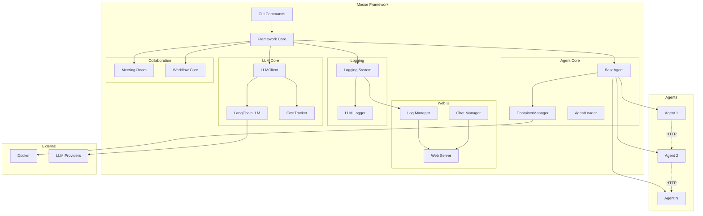
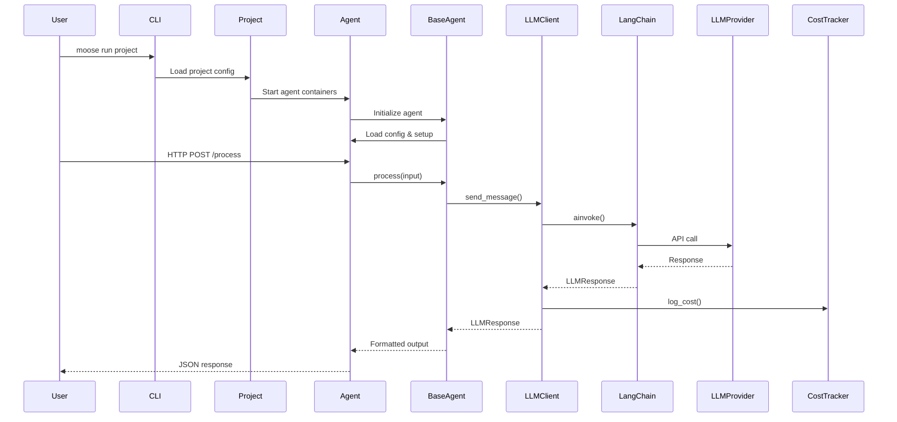

# Moose Framework

A modular agent framework built on LangGraph for creating, deploying, and managing AI agents. Moose provides a unified interface for LLM interactions, Docker-based containerization, hierarchical logging, and agent collaboration patterns.

## Features

- **Universal LLM Client**: Unified interface for OpenAI, Anthropic, and Google models with automatic chunking, cost tracking, and tool calling
- **Agent Containerization**: Docker-based deployment with auto-generated Dockerfiles and project isolation
- **Multiple Communication Modes**: HTTP server, stdin/stdout, and file-watch modes
- **Hierarchical Logging**: Project-based logging with console, file, and web UI integration
- **Agent Collaboration**: Meeting Room pattern for multi-agent coordination
- **LangGraph Integration**: Workflow support for complex agent interactions
- **Cost Tracking**: Automatic token counting and cost calculation
- **Web UI**: Real-time log streaming and LLM trace visualization

## Installation

```bash
# Clone the repository
git clone <repository-url>
cd Moose

# Install dependencies
pip install -r requirements.txt
```

## Quick Start

### 1. Set Environment Variables

```bash
export MOOSE_PROJECTS_DIR=/path/to/projects
export MOOSE_WEB_UI_PORT=8080  # Optional: Enable web UI

# LLM API Keys
export OPENAI_API_KEY="your-key"
export ANTHROPIC_API_KEY="your-key"
export GOOGLE_API_KEY="your-key"
```

### 2. Create a Project

```bash
python -m moose create my_project --agents agent1 agent2
```

### 3. Run a Project

```bash
python -m moose run my_project
```

### 4. Debug an Agent Locally

```bash
python -m moose agent debug --name agent1
```

### 5. Deploy an Agent

```bash
python -m moose agent deploy --name agent1
```

## Architecture Overview



## Data Flow



## Project Structure

```
Moose/
├── moose/
│   ├── framework/          # Core framework
│   │   ├── agent_core/     # Agent management & Docker
│   │   ├── llm_core/       # LLM client & providers
│   │   ├── logging/        # Logging system
│   │   ├── meet_room/      # Agent collaboration
│   │   ├── workflow_core/  # LangGraph integration
│   │   └── commands/       # CLI commands
│   ├── agents/             # Agent implementations
│   │   ├── news_scraper/
│   │   ├── finance_office/
│   │   └── telegram_stock_bot/
│   ├── web_ui/             # Web UI server
│   └── tests/              # Test suite
├── projects/               # Project directories
│   └── <project_id>/
│       ├── project_config.json
│       ├── workflow.py
│       ├── model_config.yaml
│       └── logs/
└── README.md
```

## Core Components

### [Agent Core](moose/framework/agent_core/README.md)
- **BaseAgent**: Base class for all agents with HTTP/stdin/file modes
- **ContainerManager**: Docker container lifecycle management
- **AgentLoader**: Agent discovery and configuration loading
- **AgentRegistry**: Running container tracking per project

### [LLM Core](moose/framework/llm_core/README.md)
- **LLMClient**: Universal LLM interface with auto-chunking
- **LangChainLLM**: LangChain wrapper using native provider classes
- **CostTracker**: Automatic cost calculation and logging
- **ToolRuntime**: Tool-to-tool calling with guardrails

### [Logging System](moose/framework/logging/__init__.py)
- Hierarchical loggers: `moose` → `moose.project.<id>` → `moose.agent.<name>`
- Outputs: Console, `moose.log`, `llm.log`, `agents/<name>.log`
- Web UI integration for real-time streaming

### [Meeting Room](moose/framework/meet_room/README.md)
- **ACTIVE mode**: Round-robin turn-taking
- **PASSIVE mode**: Help-style targeted messages
- Private threads and room transcripts
- Guardrails for turn/time limits

### [Workflow Core](moose/framework/workflow_core/__init__.py)
- LangGraph integration for state-based workflows
- WorkflowMixin for agent workflow support

## Creating an Agent

1. **Create agent directory**: `moose/agents/my_agent/`
2. **Create `agent_config.json`**: Define agent metadata and configuration
3. **Create `agent.py`**: Implement agent class extending `BaseAgent`
4. **Implement `process()` method**: Main agent logic

Example:

```python
from moose.framework import BaseAgent

class MyAgent(BaseAgent):
    def process(self, input_data):
        # Your agent logic here
        result = {"output": "processed"}
        return result
```

See [Agent Core README](moose/framework/agent_core/README.md) for detailed agent structure and configuration.

## CLI Commands

- `moose create <project> --agents <list>`: Create new project with enabled agents
- `moose run <project>`: Run project with web UI and enabled agents
- `moose agent debug --name <agent>`: Run agent locally for debugging
- `moose agent deploy --name <agent>`: Deploy agent in Docker container
- `moose test <component>`: Run test suite

## Agent Communication

Agents communicate via HTTP endpoints. Each agent can:
- Expose custom endpoints via `agent_config.json`
- Call other agents via HTTP client libraries
- Share data via mounted project directory
- Use Meeting Room for collaborative tasks

## Environment Variables

- `MOOSE_PROJECTS_DIR`: Base directory for projects (default: `./projects`)
- `MOOSE_WEB_UI_PORT`: Web UI server port (optional)
- `MOOSE_LLM_CONFIG_PATH`: Override LLM config file path
- `MOOSE_LLM_CONFIG_NAME`: Override LLM config filename (default: `model_config.yaml`)
- `MOOSE_AGENT_DEBUG`: Enable debug logging for agents
- `OPENAI_API_KEY`, `ANTHROPIC_API_KEY`, `GOOGLE_API_KEY`: LLM provider API keys

## Included Agents

- **news_scraper**: Generic news scraper with web extraction
- **finance_office**: Financial analysis agent with investment research team
- **telegram_stock_bot**: Telegram bot for stock/crypto watchlists and alerts

## Documentation

- [Agent Core](moose/framework/agent_core/README.md) - Agent management and Docker deployment
- [LLM Core](moose/framework/llm_core/README.md) - LLM client and providers
- [Meeting Room](moose/framework/meet_room/README.md) - Agent collaboration patterns
- [Tests](moose/tests/README.md) - Test suite documentation

## License

See `License.txt` for license information.

## Contributing

1. Follow the existing code structure
2. Add tests for new features
3. Update relevant README files
4. Ensure all tests pass before submitting
