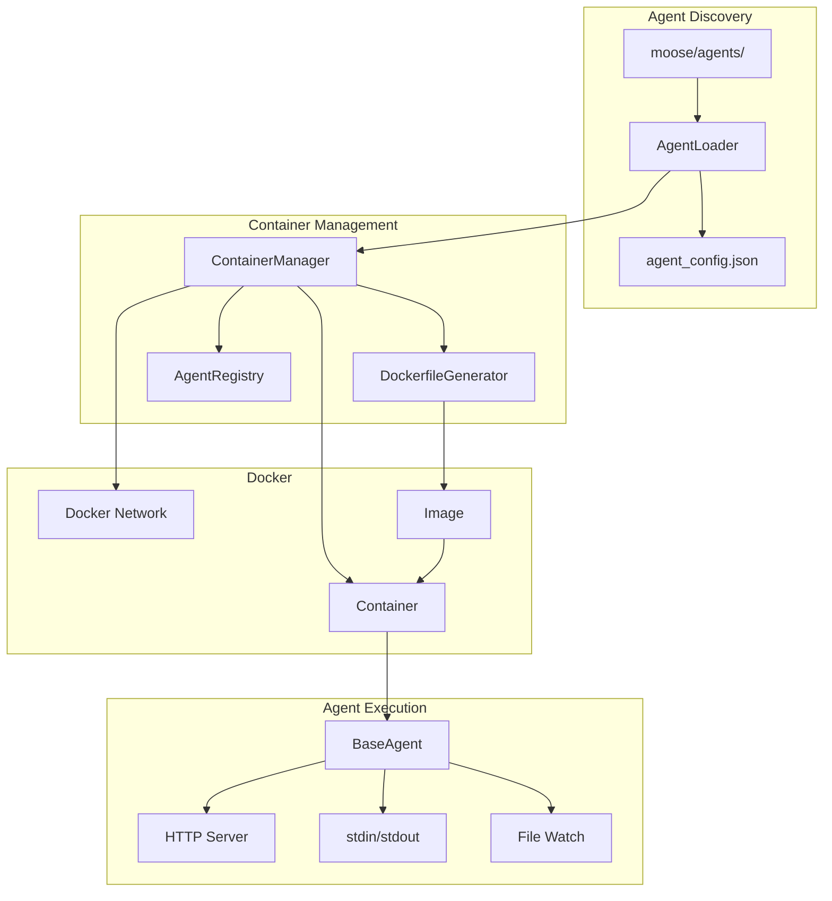
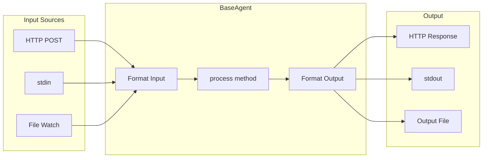
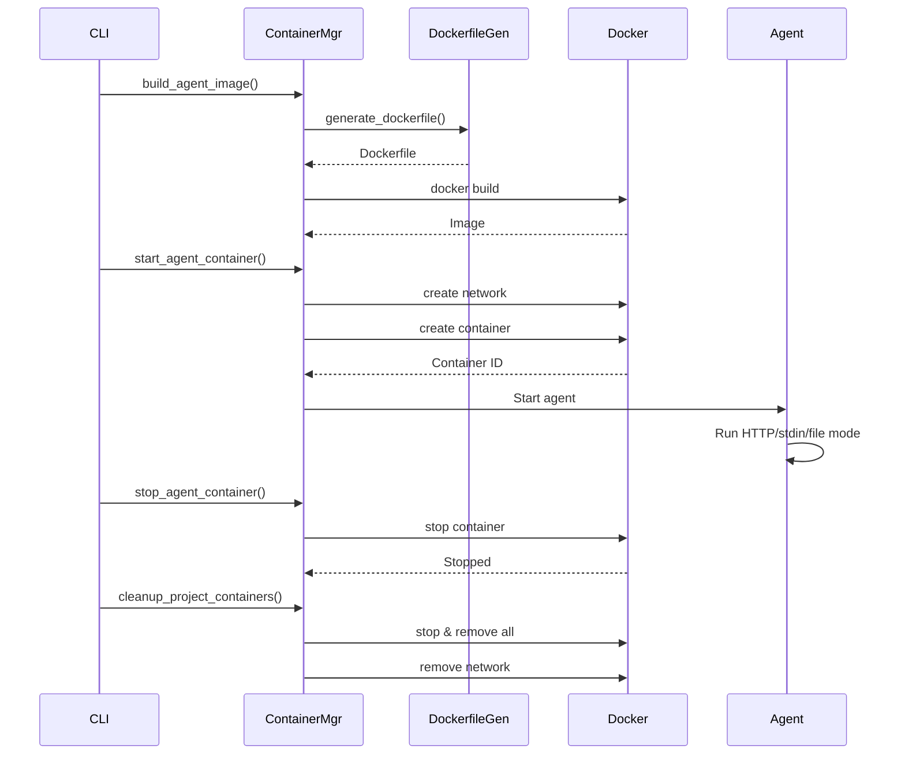

# Agent Core

Docker-based container management system for running agents in isolated environments with standardized communication protocols.

## Overview

Agent Core provides:
- **Container Lifecycle Management**: Build, start, stop agent containers
- **Agent Discovery**: Automatically discover agents from `moose/agents/`
- **Dockerfile Generation**: Auto-generate Dockerfiles from agent configuration
- **Project Isolation**: Each project gets its own Docker network (or custom network)
- **Resource Management**: CPU and memory limits per agent
- **BaseAgent**: Base class with HTTP/stdin/file communication modes

## Architecture



## Agent Structure

Each agent must be in its own directory under `moose/agents/<agent_name>/`:

```
moose/agents/
  my_agent/
    agent.py              # Agent implementation (required)
    agent_config.json     # Agent configuration (required)
    Dockerfile            # Container definition (optional - auto-generated)
    requirements.txt      # Python dependencies (optional)
    setup.sh             # Initialization script (optional)
    python_version        # Python version file (optional)
```

### Required Files

- **agent.py**: Agent implementation code extending `BaseAgent`
- **agent_config.json**: Agent metadata and configuration

### Optional Files

- **Dockerfile**: Custom container definition (auto-generated if missing)
- **requirements.txt**: Python package dependencies
- **setup.sh**: Shell script for system package installation (apt-get, etc.)
- **python_version**: Text file containing Python version (e.g., "3.11")

## Agent Configuration

`agent_config.json` follows a structured format:

### Configuration Structure

```json
{
  "name": "my_agent",
  "description": "Agent description",
  "version": "1.0.0",
  "python_version": "3.11",
  "entry_point": "agent.py",
  "entry_class": "MyAgent",
  "docker": {
    "network": "custom-network",
    "container_suffix_name": "",
    "container_override": true,
    "ports": [
      {"container": 8000, "host": 8000}
    ],
    "environment": {
      "CUSTOM_VAR": "value"
    },
    "volumes": [
      {
        "host": "/path/on/host",
        "container": "/path/in/container",
        "mode": "ro"
      }
    ],
    "resources": {
      "memory": "512m",
      "cpus": "1.0"
    }
  },
  "interactive_mode": {
    "mode": "http",
    "http_server": {
      "port": 8000,
      "auth_password": "",
      "endpoints": [
        {
          "path": "/process",
          "method": "POST",
          "handler": "process",
          "description": "Process input data",
          "auth_required": false
        }
      ]
    },
    "file": {
      "watch_dir": "/project/agent_io"
    }
  },
  "custom": {
    "agent_specific_config": "value"
  }
}
```

### Configuration Sections

#### Top-Level Fields

- **name** (required): Agent name (should match directory name)
- **description** (required): Human-readable description
- **version** (required): Agent version
- **python_version** (required): Python version for container (e.g., "3.11")
- **entry_point** (required): Python file to run (default: "agent.py")
- **entry_class** (optional): Class name to instantiate (auto-detected if not specified)

#### `docker` Object

All Docker-related settings:

- **network** (optional): Docker network name. Overrides default `moose-project-<project_id>`. Useful for sharing networks across projects.
- **container_suffix_name** (optional): Suffix to append to container name
- **container_override** (optional, default: false): Whether to override existing containers
- **ports** (optional): Array of port mappings `[{"container": 8000, "host": 8000}]`
- **environment** (optional): Environment variables `{"VAR_NAME": "value"}`
- **volumes** (optional): Additional volume mounts `[{"host": "/host/path", "container": "/container/path", "mode": "ro"}]`
- **resources** (optional): CPU and memory limits `{"memory": "512m", "cpus": "1.0"}`

#### `interactive_mode` Object

Configuration for communication mode:

- **mode** (required): `"http"`, `"stdin"`, or `"file"`
- **http_server** (required if mode is "http"):
  - **port** (required): Port to listen on
  - **auth_password** (optional): Password for HTTP authentication (X-auth-password header)
  - **endpoints** (optional): Array of custom HTTP endpoints
- **file** (required if mode is "file"):
  - **watch_dir** (required): Directory to watch for input files

#### `custom` Object

Agent-specific configuration (free-form). Examples:
- `scraper_config` for scraping agents
- `llm_config` for LLM-based agents
- `finance_office` for inter-agent communication configs

## BaseAgent

All agents extend `BaseAgent` which provides:

### Communication Modes



### Standard I/O Format

**Input Format:**
```json
{
  "request_id": "uuid",
  "agent_name": "agent_name",
  "input": <any>,
  "metadata": {
    "timestamp": "ISO8601",
    "source": "http|stdin|file",
    "user_id": "optional"
  }
}
```

**Output Format:**
```json
{
  "request_id": "uuid",
  "agent_name": "agent_name",
  "status": "success|error",
  "result": <any>,
  "error": "error message (if status=error)",
  "timestamp": "ISO8601",
  "token_cost": {
    "input_tokens": 0,
    "output_tokens": 0,
    "total_tokens": 0,
    "cost_usd": 0.0
  },
  "model_used": "model_name",
  "processing_time_ms": 123.45
}
```

### Usage Example

```python
from moose.framework import BaseAgent

class MyAgent(BaseAgent):
    def process(self, input_data):
        # input_data is the raw input (already extracted from standard format)
        # Your processing logic here
        result = {"output": "processed", "data": input_data}
        return result

# Agent automatically handles:
# - HTTP server on configured port
# - stdin/stdout JSON processing
# - File watch mode
# - Standardized I/O formatting
# - Token cost tracking
# - Logging
```

## Container Lifecycle



## Docker Network

By default, each project gets its own Docker network:
- Network name: `moose-project-<project_id>`
- All project agents are on the same network
- Enables inter-agent communication via container names

You can override this with `docker.network` in `agent_config.json` to share networks across projects.

## Volume Mounts

Default mounts:
- **Agent code**: Mounted at `/app` (read-write)
- **Project directory**: Mounted at `/project` (read-only)

Additional volumes can be specified in `agent_config.json` under `docker.volumes`.

## Usage

### Agent Discovery

```python
from moose.framework.agent_core import AgentLoader

loader = AgentLoader()

# Discover all agents
agents = loader.discover_agents()
print(f"Available agents: {agents}")

# Load agent configuration
config = loader.load_agent_config("my_agent")

# Validate agent structure
loader.validate_agent("my_agent")
```

### Container Management

```python
from moose.framework.agent_core import ContainerManager
from pathlib import Path

manager = ContainerManager()

# Build image
image_name = manager.build_agent_image("my_agent", force_rebuild=True)

# Start container
container_id = manager.start_agent_container(
    agent_name="my_agent",
    project_id="my_project",
    project_dir=Path("/path/to/project")
)

# Check status
status = manager.get_container_status("my_agent", "my_project")

# Get logs
logs = manager.get_container_logs("my_agent", "my_project", tail=50)

# Stop container
manager.stop_agent_container("my_agent", "my_project")

# Cleanup all project containers
manager.cleanup_project_containers("my_project")
```

### Custom HTTP Endpoints

Define custom endpoints in `agent_config.json`:

```json
{
  "interactive_mode": {
    "http_server": {
      "endpoints": [
        {
          "path": "/custom",
          "method": "POST",
          "handler": "my_handler_method",
          "auth_required": false
        }
      ]
    }
  }
}
```

Implement the handler in your agent:

```python
class MyAgent(BaseAgent):
    def my_handler_method(self, data):
        # data is request.get_json() or request.args.to_dict()
        return {"status": "success", "result": "custom response"}
    
    def process(self, input_data):
        return {"result": "default processing"}
```

## Environment Variables

- `MOOSE_AGENTS_DIR`: Override agents directory (default: `moose/agents/`)
- `MOOSE_DOCKER_NETWORK_PREFIX`: Network prefix (default: `moose-project-`)
- `MOOSE_DOCKER_IMAGE_PREFIX`: Image prefix (default: `moose-agent-`)
- `MOOSE_AGENT_DEBUG`: Enable debug logging for agents
- `MOOSE_PROJECT_ID`: Current project identifier
- `MOOSE_PROJECTS_DIR`: Base directory for projects

## Requirements

- Docker installed and running
- `docker` Python library: `pip install docker`
- Docker daemon accessible

## Error Handling

The system handles:
- Docker daemon not running
- Image build failures
- Container start failures
- Missing agent files
- Invalid configurations

All errors are logged with appropriate error messages and stack traces.
