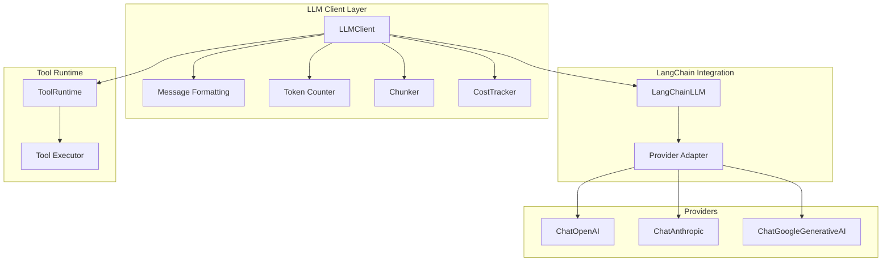
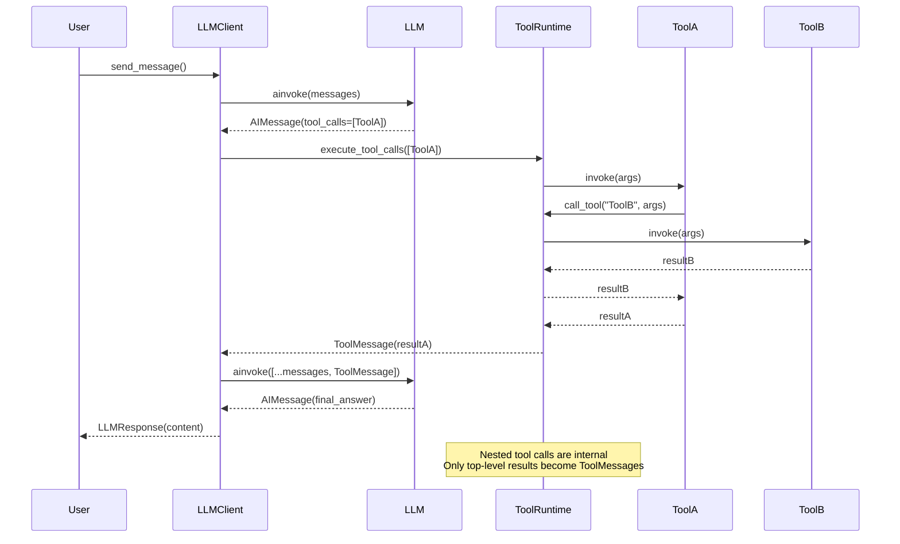
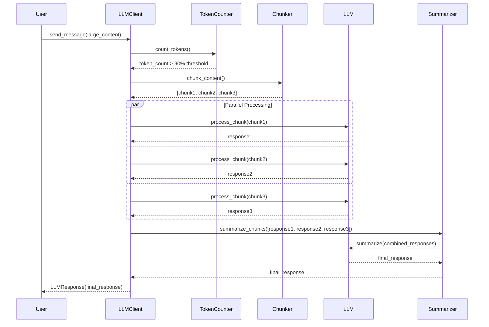
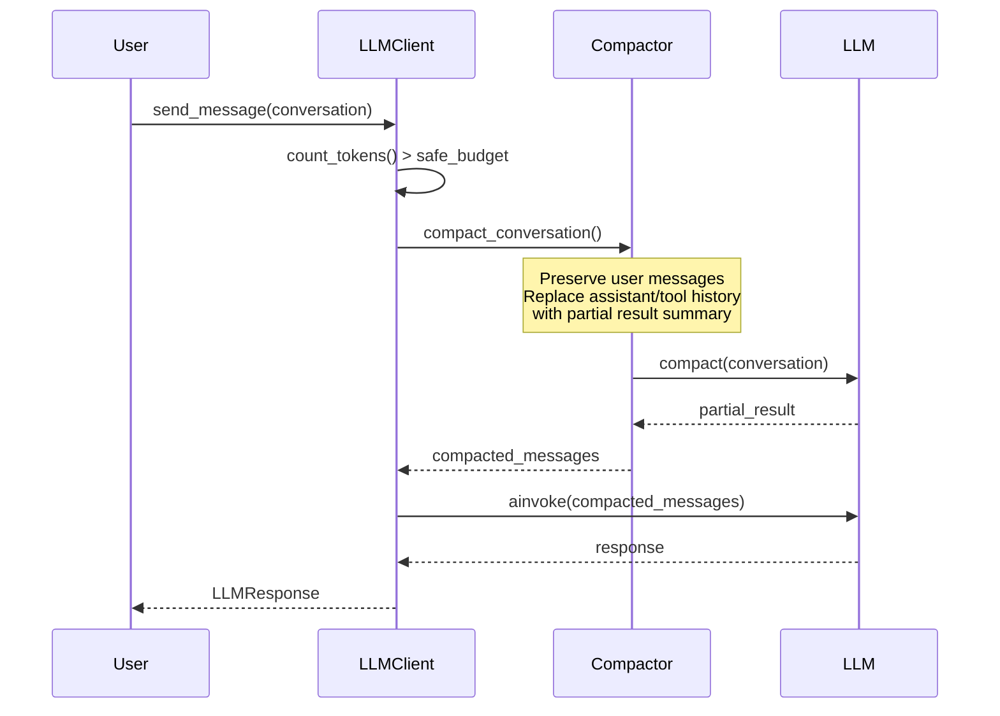

# LLM Core - Universal LLM Interaction Layer

A unified interface for interacting with multiple LLM providers (OpenAI, Anthropic, Google, etc.) using LangChain. Includes automatic token counting, intelligent chunking for large inputs, cost tracking, and async support.

## Installation

Install the required dependencies:

```bash
pip install langchain langchain-openai langchain-anthropic langchain-google-genai tiktoken pyyaml
```

## Architecture



The LLM Core uses **LangChain** with native provider classes to provide:
- **Unified API**: Same interface regardless of provider
- **Automatic Token Counting**: Uses `tiktoken` to accurately count tokens
- **Intelligent Chunking**: Automatically splits large inputs (>90% of model limit) with 10% overlap
- **Conversation Compaction**: LLM-powered compaction for long conversation history
- **Cost Tracking**: Automatic cost calculation based on token usage and model rates
- **Async Support**: Full async/await support for non-blocking operations
- **Streaming**: Support for streaming responses
- **Multi-stage Reasoning**: Iterative tool calling with completion markers

The framework uses native LangChain provider classes:
- **OpenAI** → `ChatOpenAI`
- **Anthropic** → `ChatAnthropic`
- **Google Gemini** → `ChatGoogleGenerativeAI`

### ToolRuntime (tool→tool calls)

`ToolRuntime` enables **tool→tool calls** during a single `_send_message_direct` request, with shared safety controls and tracing.

Key properties:
- Nested tool→tool calls are **internal**: they are executed and logged, but **not appended as ToolMessages** in the LLM conversation. Only the top-level LLM-requested tool results become ToolMessages.
- Any running tool can access the runtime via `ToolRuntime.current()` (contextvar), and call other tools by name with `await runtime.call_tool(name, args)`.
- Guardrails are enforced (depth limit, cycle detection, per-call timeout).

#### Example: calling another tool from inside a tool

```python
from moose.framework.llm_core.tool_runtime import ToolRuntime

async def some_tool(symbol: str) -> dict:
    rt = ToolRuntime.current()
    if rt is None:
        return {"ok": False, "error": "ToolRuntime not available"}

    edgar_env = await rt.call_tool("list_financing_documents_index", {"ticker": symbol, "since_days": 365})
    return {"ok": True, "data": {"edgar_financing_index": edgar_env}}
```

#### Dataflow



### Event Loop

`LLMClient` now exposes a first-class event loop API in addition to the existing
high-level `send_message()` wrapper.

Primary APIs:

- `run_agent_loop(...)` - async iterator of typed lifecycle events
- `collect_agent_loop(...)` - runs the loop and returns an `AgentLoopResult`
- `send_message(...)` - backward-compatible wrapper that internally uses the collector and returns only `LLMResponse`

Key properties:

- Covers both direct and chunked execution paths
- Emits top-level LLM/tool lifecycle events
- Emits nested internal tool events from `ToolRuntime`
- Preserves provider-native assistant content blocks in events
- Reuses existing tracing/request IDs so events can be correlated with spans and trace DB records

#### Event Taxonomy

Main lifecycle:

- `run_start`
- `iteration_start`
- `context_trim`
- `llm_call_start`
- `llm_response`
- `tool_batch_start`
- `tool_call_start`
- `tool_call_success`
- `tool_call_error`
- `continuation_prompt_added`
- `forced_finalization_start`
- `forced_finalization_complete`
- `run_end`
- `run_error`

Chunked path:

- `chunking_start`
- `chunking_fallback`
- `chunk_start`
- `chunk_complete`
- `chunk_summary_start`
- `chunk_summary_complete`

Scopes:

- `main` - normal top-level loop execution
- `chunk` - per-chunk work during automatic chunking
- `summary` - final chunk aggregation call
- `forced_final` - tool-budget-exhausted finalization
- `nested_tool` - internal tool-to-tool calls via `ToolRuntime`

#### Consume the Event Stream

```python
from moose.framework.llm_core import LLMClient, AgentLoopEventType

client = LLMClient(model="gpt-4o", tools=[...])

async for event in client.run_agent_loop(
    "Find the download URL on this website and explain the steps you took."
):
    if event.event_type == AgentLoopEventType.LLM_RESPONSE:
        print("assistant:", event.assistant_text)
    elif event.event_type == AgentLoopEventType.TOOL_CALL_START:
        print("tool start:", event.tool_name, event.tool_args)
    elif event.event_type == AgentLoopEventType.TOOL_CALL_SUCCESS:
        print("tool success:", event.tool_name)
```

#### Collect a Structured Result

```python
from moose.framework.llm_core import LLMClient

client = LLMClient(model="gpt-4o", tools=[...])

result = await client.collect_agent_loop(
    "Investigate this page and summarize what happened.",
    raise_on_error=True,
)

print(result.final_response.content)
print(result.stop_reason)
print(len(result.events))
print(result.total_usage)
print(result.total_cost)
```

`AgentLoopResult` includes:

- `final_response`
- `events`
- `final_conversation_messages`
- `stop_reason`
- `iteration_count`
- `total_usage`
- `total_cost`
- `error_type` / `error_message`
- `callback_errors`

#### Use Callbacks

Callbacks are observational in v1. They do not control tool execution.

```python
class AuditCallback:
    def on_event(self, event):
        print(event.event_type.value, event.scope.value)

    def on_tool_call_error(self, event):
        print("tool failed:", event.tool_name, event.error_message)

client = LLMClient(model="gpt-4o", tools=[...])

result = await client.collect_agent_loop(
    "Inspect this workflow",
    callbacks=[AuditCallback()],
    raise_on_error=True,
)
```

If a callback raises, the loop keeps running. Errors are recorded in
`AgentLoopResult.callback_errors`.

#### Compatibility With Existing Callers

Existing code can keep using:

```python
response = await client.send_message("Hello")
```

This still returns `LLMResponse`, but it now runs through the same event-driven
runtime as `run_agent_loop()` / `collect_agent_loop()`.

## Supported Providers

- **OpenAI** (GPT-4, GPT-4 Turbo, GPT-3.5, GPT-4o, etc.)
- **Anthropic** (Claude 3 Opus, Sonnet, Haiku, Claude 3.5 Sonnet, etc.)
- **Google** (Gemini Pro, Gemini 2.5 Flash, etc.)

## Basic Usage

### Simple Message

```python
from moose.framework.llm_core import LLMClient

# Initialize client (provider is auto-detected from model name)
client = LLMClient(model="gpt-4")

# Send a message (async)
response = await client.send_message("Hello, how are you?")
print(response.content)
```

### Synchronous Wrapper

For convenience, synchronous wrappers are available:

```python
from moose.framework.llm_core import LLMClient

client = LLMClient(model="gpt-4")

# Synchronous call (uses asyncio.run internally)
response = client.send_message_sync("Hello, how are you?")
print(response.content)
```

### With System Message

```python
client = LLMClient(model="claude-3-opus-20240229")

response = await client.send_message(
    message="What is the capital of France?",
    system_message="You are a helpful assistant."
)
print(response.content)
```

### Conversation with History

```python
from moose.framework.llm_core import Message, MessageRole

client = LLMClient(model="gemini-pro")

# First message
response1 = await client.send_message("My name is Alice")
print(response1.content)

# Continue conversation
messages = [
    Message(role=MessageRole.USER, content="My name is Alice"),
    Message(role=MessageRole.ASSISTANT, content=response1.content)
]

response2 = await client.send_message(
    message="What's my name?",
    messages=messages
)
print(response2.content)
```

### Streaming Responses

```python
client = LLMClient(model="gpt-4")

async for chunk in client.stream_message("Tell me a story"):
    print(chunk, end="", flush=True)
```

### Explicit Provider

```python
from moose.framework.llm_core import LLMClient, LLMProvider

client = LLMClient(
    model="claude-3-opus-20240229",
    provider=LLMProvider.ANTHROPIC,
    api_key="your-api-key"
)
```

### Custom Parameters

```python
client = LLMClient(
    model="gpt-4",
    temperature=0.7,
    max_output_tokens=500,
    max_input_tokens=128000,  # Default: 128000
    timeout=30.0
)

response = await client.send_message("Explain quantum computing", temperature=0.5)
```

## Automatic Chunking

The LLM client automatically handles large inputs that exceed 90% of the model's maximum input tokens:

1. **Token Counting**: Uses `tiktoken` to accurately count tokens
2. **Chunking**: Splits content into chunks (90% of max tokens per chunk)
3. **Overlap**: Each chunk has 10% overlap with the previous chunk for context
4. **Parallel Processing**: All chunks are processed in parallel using `asyncio.gather`
5. **Summarization**: Chunk responses are aggregated and sent to a final summarization step

### Chunking Flow



### Conversation Compaction

For long conversations that exceed context limits, the client uses LLM-powered compaction:



The compaction:
- Preserves all original user messages
- Replaces assistant/tool history with a single synthetic USER message containing a partial result
- Uses incremental updates if previous partial results exist
- Falls back to deterministic truncation if compaction fails

### Chunking Example

```python
client = LLMClient(model="gpt-4", max_input_tokens=128000)

# Large input that exceeds 90% of max_input_tokens will be automatically chunked
large_content = "..."  # Very long text

response = await client.send_message(
    message=large_content,
    system_message="Summarize the key points"
)
# The client automatically:
# 1. Detects the input is too large
# 2. Splits it into chunks with 10% overlap
# 3. Processes chunks in parallel
# 4. Summarizes the chunk responses into a final answer
```

## Async Operations

All LLM operations support async/await for non-blocking execution:

```python
import asyncio

async def process_multiple_queries():
    client = LLMClient(model="gpt-4")
    
    # Process multiple queries concurrently
    tasks = [
        client.send_message("What is AI?"),
        client.send_message("What is ML?"),
        client.send_message("What is NLP?")
    ]
    
    responses = await asyncio.gather(*tasks)
    for response in responses:
        print(response.content)

# Run async function
asyncio.run(process_multiple_queries())
```

## API Reference

### LLMClient

#### `__init__(model, provider=None, api_key=None, ...)`

Initialize the LLM client.

**Parameters:**
- `model` (str): Model name (e.g., "gpt-4", "claude-3-opus-20240229", "gemini-pro")
- `provider` (LLMProvider, optional): Explicit provider. Auto-detected if None.
- `api_key` (str, optional): API key. Uses environment variables if None.
- `temperature` (float): Sampling temperature (default: 1.0)
- `max_output_tokens` (int, optional): Maximum output tokens to generate
- `max_tokens` (int, optional): Deprecated alias for `max_output_tokens` (backward compatibility)
- `max_input_tokens` (int, optional): Maximum input tokens for the model (default: 128000)
- `timeout` (float, optional): Request timeout in seconds
- `config` (ModelConfig, optional): ModelConfig instance for cost calculation

#### `async send_message(message, messages=None, system_message=None, **kwargs)`

Send a message and receive a response (async).

**Returns:** `LLMResponse` object with:
- `content` (str): Response text
- `model` (str): Model used
- `finish_reason` (str): Reason for completion
- `usage` (dict): Token usage statistics (`input_tokens`, `output_tokens`)
- `cost` (float): Calculated cost in USD
- `raw_response`: Raw LangChain response
- `request_id` (str): Unique request identifier

**Synchronous wrapper:** `send_message_sync()` - same parameters, synchronous execution

#### `async send_messages(messages, system_message=None, **kwargs)`

Send multiple messages in a conversation (async).

**Synchronous wrapper:** `send_messages_sync()` - same parameters, synchronous execution

#### `async stream_message(message, messages=None, system_message=None, **kwargs)`

Stream response chunks as they arrive (async generator).

#### `async ainvoke(message, messages=None, system_message=None, **kwargs)`

Low-level async invoke method (used internally).

### LangChainLLM

Direct access to the LangChain wrapper:

```python
from moose.framework.llm_core import LangChainLLM

llm = LangChainLLM(model="gpt-4", temperature=0.7)

# Synchronous
response = llm.invoke("Hello!")

# Async
response = await llm.ainvoke("Hello!")
```

## Configuration

### Config File Setup

The framework uses a `config.yaml` file to configure model cost rates.

1. **Create config file**: Copy the template or create `config.yaml` in your project directory:
   ```bash
   cp moose/framework/llm_core/config.yaml.template config.yaml
   ```

2. **Customize models**: Edit `config.yaml` to add your models and set cost per token:
   ```yaml
   models:
     - model_name: gpt-4
       input_cost_per_million_token: 30.0
       output_cost_per_million_token: 60.0
     - model_name: claude-3-opus-20240229
       input_cost_per_million_token: 15.0
       output_cost_per_million_token: 75.0
   ```

The framework will automatically:
- Find `config.yaml` in current directory
- Use environment variable `MOOSE_LLM_CONFIG_PATH` to override location
- Use environment variable `MOOSE_LLM_CONFIG_NAME` to override filename (default: `model_config.yaml`)
- Generate default config if none found

### Environment Variables

Set API keys as environment variables:

```bash
export OPENAI_API_KEY="your-key"
export ANTHROPIC_API_KEY="your-key"
export GOOGLE_API_KEY="your-key"

# Optional: Override config file location
export MOOSE_LLM_CONFIG_PATH="/path/to/config.yaml"

# Optional: Override config file name
export MOOSE_LLM_CONFIG_NAME="my_model_config.yaml"
```

## Cost Tracking

Cost tracking is automatic when using the client. Costs are calculated based on:
- Token usage (input and output tokens)
- Model-specific cost rates from `config.yaml`
- Logged to daily log files

### Cost Logging

- **Location**: `projects/<project_id>/logs/llm_costs_YYYY-MM-DD.log` (falls back to `projects/default/logs/` if project is unset)
- **Format**: JSON lines with timestamp, model, cost, tokens, request_id
- **Access**: Use `CostTracker` class to query costs

### Viewing Costs

```python
from moose.framework.llm_core import CostTracker

tracker = CostTracker()

# Get today's total cost
total = tracker.get_daily_total()
print(f"Today's total: ${total:.2f}")

# Get cost for specific model
model_cost = tracker.get_model_total("gpt-4")
print(f"GPT-4 cost today: ${model_cost:.2f}")
```

### Cost in Responses

Cost is automatically included in `LLMResponse`:

```python
response = await client.send_message("Hello")
print(f"Cost: ${response.cost:.6f}")
print(f"Input tokens: {response.usage.get('input_tokens', 0)}")
print(f"Output tokens: {response.usage.get('output_tokens', 0)}")
```

## Token Counting

The client uses `tiktoken` for accurate token counting:

- Automatically selects the appropriate encoding based on model
- Falls back to `cl100k_base` (GPT-3.5/4, Claude) if model-specific encoding not found
- Estimates token count if `tiktoken` is unavailable (1 token ≈ 4 characters)

### Manual Token Counting

```python
client = LLMClient(model="gpt-4")

# Count tokens in text
token_count = client._count_tokens("Hello, world!")
print(f"Tokens: {token_count}")

# Count tokens for a full message request
total_tokens = client._count_message_tokens(
    message="Hello",
    system_message="You are helpful",
    messages=[...]
)
print(f"Total tokens: {total_tokens}")
```

## Examples

### Switching Between Providers

```python
# Same API, different providers
openai_client = LLMClient(model="gpt-4")
claude_client = LLMClient(model="claude-3-opus-20240229")
gemini_client = LLMClient(model="gemini-pro")

# All use the same interface
response1 = await openai_client.send_message("Hello")
response2 = await claude_client.send_message("Hello")
response3 = await gemini_client.send_message("Hello")
```

### Parallel Processing

```python
import asyncio

async def analyze_multiple_articles(articles):
    client = LLMClient(model="gpt-4")
    
    tasks = [
        client.send_message(
            message=article,
            system_message="Summarize this article"
        )
        for article in articles
    ]
    
    responses = await asyncio.gather(*tasks)
    return [r.content for r in responses]

# Process 10 articles concurrently
articles = ["Article 1...", "Article 2...", ...]
summaries = asyncio.run(analyze_multiple_articles(articles))
```

### Error Handling

```python
from moose.framework.llm_core import LLMClient

try:
    client = LLMClient(model="gpt-4")
    response = await client.send_message("Hello")
except ImportError:
    print("Please install langchain: pip install langchain langchain-openai")
except Exception as e:
    print(f"Error: {e}")
```

### Using LangChain Directly

If you need direct access to LangChain classes:

```python
from moose.framework.llm_core import LangChainLLM

llm = LangChainLLM(model="gpt-4", temperature=0.7)

# Use LangChain's native methods
response = await llm.ainvoke("Hello!")
print(response.content)
```

## Model Configuration

### Supported Models

The framework supports models from three providers:

**OpenAI:**
- `gpt-4`, `gpt-4-turbo`, `gpt-4o`
- `gpt-3.5-turbo`

**Anthropic:**
- `claude-3-opus-20240229`
- `claude-3-sonnet-20240229`
- `claude-3-5-sonnet-20241022`
- `claude-sonnet-4-20250514`
- `claude-sonnet-4-5-20250929`

**Google:**
- `gemini-pro`
- `gemini-2.5-flash`

### Adding Custom Models

Add your model to `config.yaml`:

```yaml
models:
  - model_name: your-custom-model
    input_cost_per_million_token: 10.0
    output_cost_per_million_token: 20.0
```

The provider will be auto-detected from the model name, or you can specify it explicitly:

```python
client = LLMClient(
    model="your-custom-model",
    provider=LLMProvider.OPENAI  # or ANTHROPIC, GOOGLE
)
```
