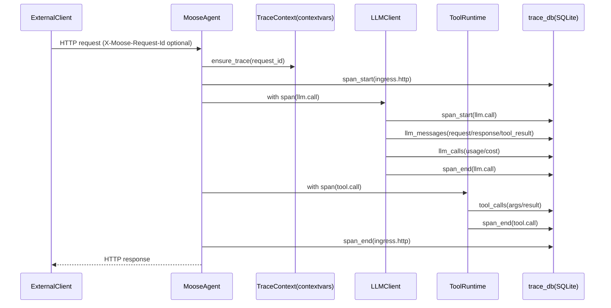

# Moose Logging & Tracing

This folder contains the core **logging** and **distributed tracing** building blocks used across Moose agents.

## Overview

- **Standard logs**: human-readable log lines (and some structured JSON entries) written to:
  - `projects/<project_id>/logs/moose.log`
  - `projects/<project_id>/logs/agents/<agent_name>.log*`
- **Structured LLM logs**: emitted by `LLMLogger` as JSON entries (and now also persisted into SQLite).
- **Tracing**: `request_id` is a **trace-wide correlation ID** (one per user/business request). Every step is recorded as a **span** with parent/child relationships.
- **SQLite trace store**: `projects/<project_id>/logs/trace.db` stores spans, LLM messages, tool calls, and trace metadata so the Web UI can render the full chain.

## Data flow

## Key concepts

### Trace ID (`request_id`)

Moose uses **one `request_id` per end-to-end request** (telegram → finance_office → investment_research_team → specialists → team_merge).

Propagation:
- **HTTP**: `X-Moose-Request-Id` + `X-Moose-Parent-Span-Id`
- **in-process**: `contextvars` (no need to thread IDs through function signatures)

### Spans (`span_id`, `parent_span_id`)

Every operation (HTTP ingress/egress, workflow node, LLM call, tool call) runs inside a span:
- `span_id`: unique identifier for the operation
- `parent_span_id`: span that caused/triggered this operation (for tree reconstruction)

### SQLite store (`trace.db`)

Tables (v1):
- `traces`: one row per `request_id`
- `spans`: one row per span (kind/name/timing/status/attrs)
- `llm_messages`: ordered messages per `llm.call` span
- `llm_calls`: usage/cost summary for `llm.call` spans
- `tool_calls`: args/result for `tool.call` spans

## Important files

- `tracing.py`: TraceContext + span context manager + exporter registration
- `trace_db.py`: SQLite schema + background writer + SpanExporter implementation
- `http_client.py`: httpx/requests helpers that create egress spans and inject propagation headers
- `__init__.py`: existing MooseLogger/LLMLogger and project logging initialization (`set_project`)

## Operational notes

- SQLite is configured with **WAL** + `busy_timeout=30000` to work across processes/containers.
- DB writes are **best-effort** and performed in a background thread to avoid blocking request handling.
- Message/tool payloads are size-capped when persisted to SQLite.

