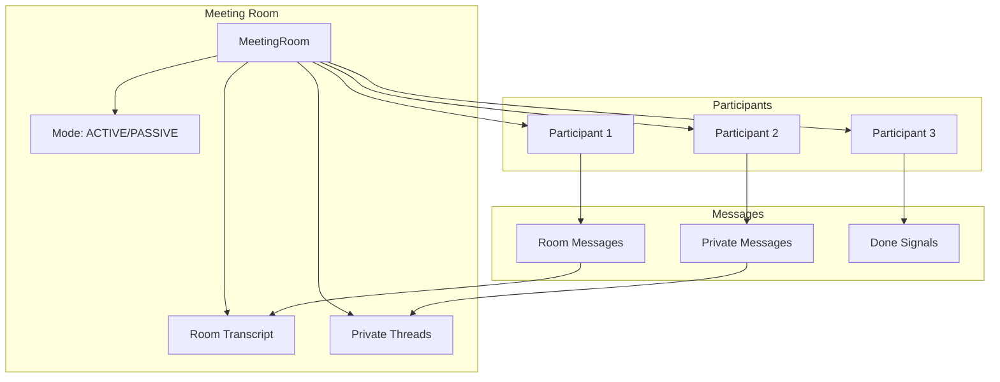
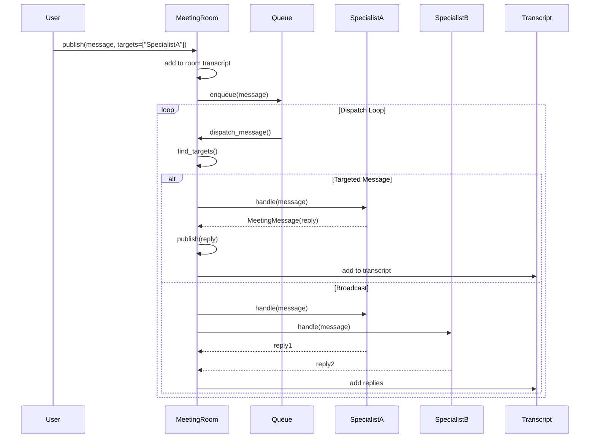
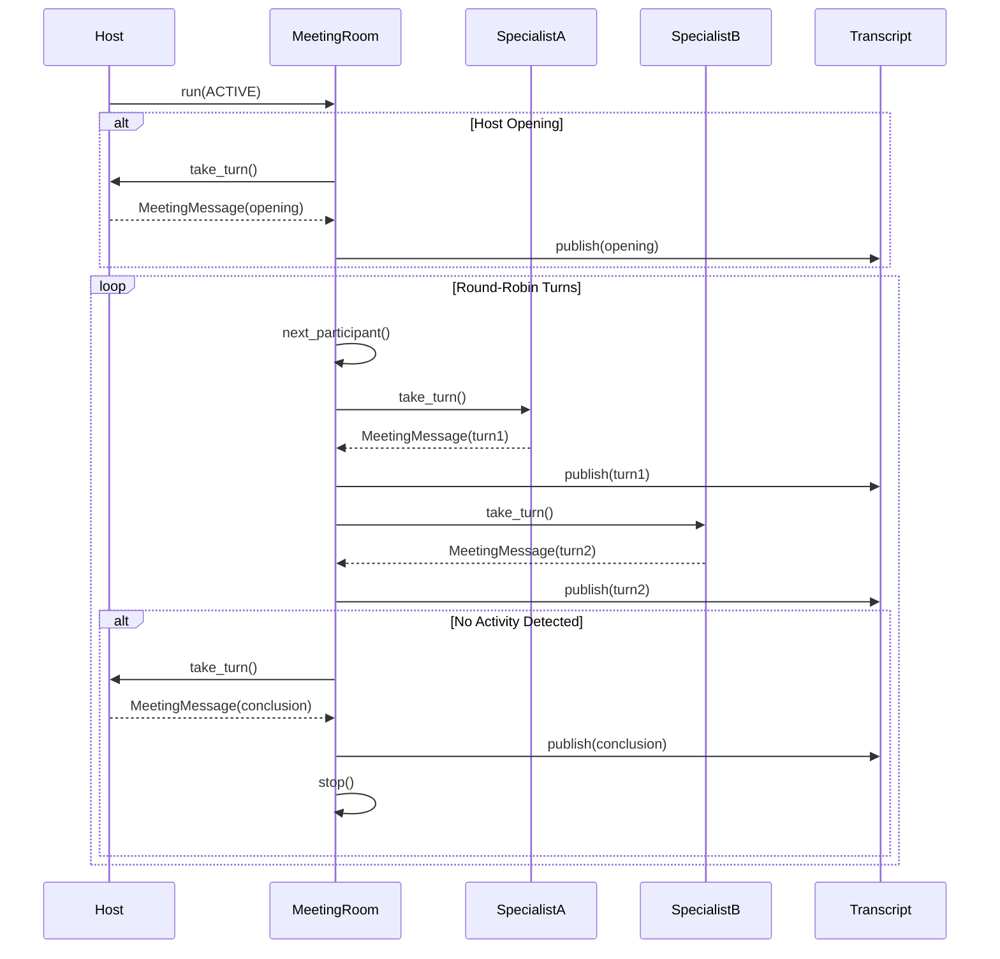
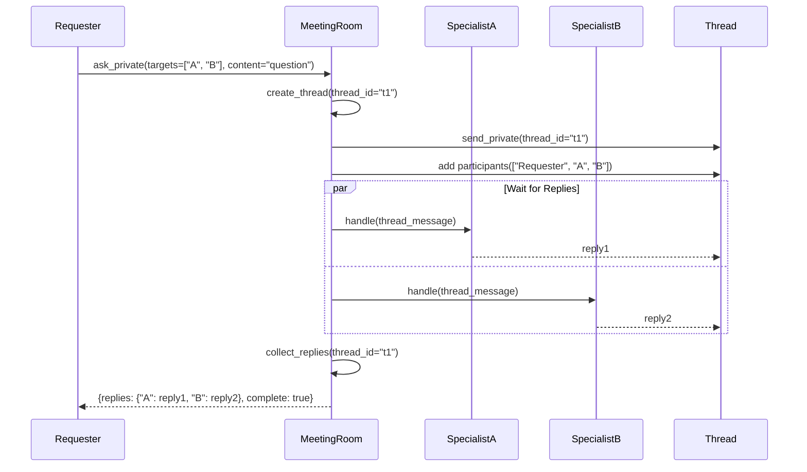

# Meeting Room

Lightweight meeting room capability for Moose agents and LLM clients, enabling structured multi-agent collaboration.

## Overview

Meeting Room supports two interaction styles:
- **ACTIVE**: Turn-taking with configurable order system (e.g., round-robin, defense) and optional host coordination
- **PASSIVE**: Help-style targeted messages (ask/answer), with an auto-start dispatch loop

Features:
- Shared room transcripts (visible to all participants)
- Private threads (visible only to thread participants)
- Guardrails (max turns, time limits, per-participant limits)
- Done signals for structured completion
- Contextvar-based room access for tools
- Configurable turn-taking orders (round-robin, defense, etc.)
- Round tracking and management

## Key concepts

### Participants

A meeting room has 2+ participants. Participants are normalized via a small interface (`MeetingParticipant`) and adapters:
- `LLMClientParticipant`: wraps an `LLMClient` (tool scopes remain on the client).
- `BaseAgentParticipant`: wraps a `BaseAgent` (via a provided `talk_fn` adapter).

Participants decide what to publish by returning `[]` (say nothing) or `MeetingMessage` objects.

### Messages

`MeetingMessage` includes:
- `role`: `system|human|assistant|tool`
- `targets`:
  - `None`: broadcast (stored in the room transcript)
  - `["a","b"]`: directed message (stored in transcript, but only targeted participants are asked to respond)
- `thread_id`:
  - `None`: shared room transcript
  - non-None: private thread transcript (visible only to thread participants)
- `metadata`: arbitrary dict; reserved key: `{"done": true}` for structured completion signaling.

### Guardrails

`Guardrails` includes:
- `max_turns`, `max_time_s`
- per-participant limits: `max_messages_per_participant`, `min_reply_interval_s`
- passive policy: `respond_only_if_targeted_in_passive`
- done handling: `allow_done_exit`, `done_behavior` (`leave` vs `wait_only`)
- help waiting timeout: `help_timeout_s` (used by `ask_private`)

### Orders (ACTIVE mode only)

ACTIVE mode meetings use an **order** system to control turn-taking. Orders are classes that implement the `MeetingOrder` interface:

- `RoundRobinOrder`: Participants speak in circular order (default round-robin behavior)
- Custom orders: Implement `MeetingOrder` for specialized turn-taking patterns (e.g., defense mode)

**Required for ACTIVE mode**: You must specify an order when creating an ACTIVE mode room:

```python
from moose.framework.meet_room import MeetingRoom, MeetingMode, RoundRobinOrder

room = MeetingRoom(
    room_id="my_meeting",
    mode=MeetingMode.ACTIVE,
    order=RoundRobinOrder(),  # Required!
    guardrails=Guardrails(max_turns=10)
)
```

**Round tracking**: The room tracks the current round number:
- `room.current_round()` - Get current round number
- `room.increment_round()` - Increment round counter
- `room.reset_round()` - Reset round counter to 0

**Order interface**:
- `get_next_speaker(room, context)` - Returns next participant to speak
- `requires_host()` - Whether this order requires a host
- `should_host_speak(room, context)` - Whether host should speak now
- `is_final_round(room)` - Check if current round is final
- `on_round_start(room)` / `on_round_end(room)` - Hooks for round transitions

### Context (per-request)

Tools can access the active meeting room via a contextvar:

- `MeetingRoom.set_current(room)` / `MeetingRoom.reset_current(token)`
- `MeetingRoom.current()`

This is useful for implementing tool-call based cross-specialist help, where the tool implementation needs
to locate the room without threading a reference through every call chain.

## `ask_private` (send + wait for replies)

`ask_private(...)` sends a private message to one or more targets and waits until each target has replied at least once
in that private thread, or until `help_timeout_s` expires.

Return shape:

- `thread_id`: str
- `request`: dict (serialized MeetingMessage)
- `replies`: dict mapping `{target_id: serialized MeetingMessage}`
- `complete`: bool
- `missing_targets`: list[str]

## Usage Example

```python
from moose.framework.meet_room import MeetingRoom, MeetingMode, Guardrails, RoundRobinOrder
from moose.framework.meet_room.participants import LLMClientParticipant

# Create PASSIVE mode meeting room (no order needed)
room = MeetingRoom(
    room_id="research_meeting",
    mode=MeetingMode.PASSIVE,
    guardrails=Guardrails(
        max_turns=100,
        max_time_s=3600,
        help_timeout_s=30.0
    )
)

# Create ACTIVE mode meeting room (order required)
active_room = MeetingRoom(
    room_id="active_meeting",
    mode=MeetingMode.ACTIVE,
    order=RoundRobinOrder(),  # Required for ACTIVE mode
    guardrails=Guardrails(max_turns=50, max_time_s=1800)
)

# Add participants
client1 = LLMClient(model="gpt-4")
participant1 = LLMClientParticipant(
    participant_id="analyst",
    llm_client=client1,
    system_message="You are a financial analyst."
)
await room.add_participant(participant1)

# Send message
await room.send_room(
    sender_id="user",
    role=MeetingRole.HUMAN,
    content="Analyze AAPL stock",
    targets=["analyst"]
)

# Ask private question
result = await room.ask_private(
    sender_id="user",
    role=MeetingRole.HUMAN,
    content="What is the P/E ratio?",
    targets=["analyst"]
)
print(result["replies"]["analyst"]["content"])
```

## `ask_specialist` Tool Contract

MCP tool bases expose an async tool named `ask_specialist` with signature:

- `target: str` — meeting room participant id (e.g., `edgar`, `fmp_fundamentals`)
- `instruction: str` — clear request to execute and return results
- `thread_id: Optional[str]` — reuse a thread for correlation/follow-ups

It uses `MeetingRoom.current()` + `MeetingRoom.ask_private()` internally and returns:

```json
{
  "ok": true,
  "data": {
    "target": "participant_id",
    "thread_id": "thread_id",
    "request": {...},
    "reply": {...}
  },
  "error": null,
  "meta": {...}
}
```

## Architecture



## Dataflow Diagrams

### PASSIVE Targeted Help (Auto Dispatch)



### ACTIVE Mode with Round-Robin Order



### Private Thread Communication




