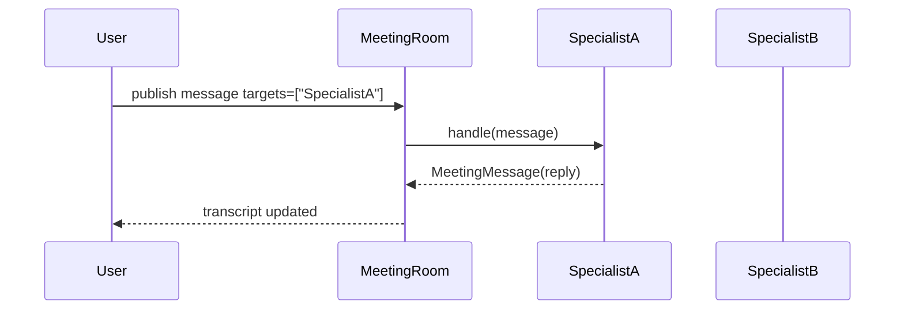
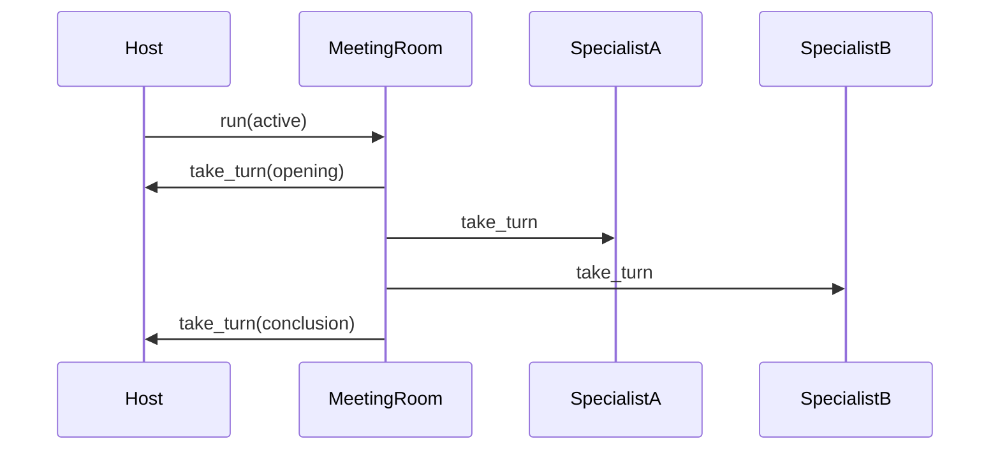

# Meeting Room (`meet_room`)

This module provides a lightweight “meeting room” capability for Moose agents and LLM clients.

It supports two interaction styles:
- **ACTIVE**: round-robin turn-taking with an optional host that opens/closes the meeting.
- **PASSIVE**: help-style targeted messages (ask/answer), with an auto-start dispatch loop.

## Key concepts

### Participants

A meeting room has 2+ participants. Participants are normalized via a small interface (`MeetingParticipant`) and adapters:
- `LLMClientParticipant`: wraps an `LLMClient` (tool scopes remain on the client).
- `BaseAgentParticipant`: wraps a `BaseAgent` (via a provided `talk_fn` adapter).

Participants decide what to publish by returning `[]` (say nothing) or `MeetingMessage` objects.

### Messages

`MeetingMessage` includes:
- `role`: `system|human|assistant|tool`
- `targets`:
  - `None`: broadcast (stored in the room transcript)
  - `["a","b"]`: directed message (stored in transcript, but only targeted participants are asked to respond)
- `thread_id`:
  - `None`: shared room transcript
  - non-None: private thread transcript (visible only to thread participants)
- `metadata`: arbitrary dict; reserved key: `{"done": true}` for structured completion signaling.

### Guardrails

`Guardrails` includes:
- `max_turns`, `max_time_s`
- per-participant limits: `max_messages_per_participant`, `min_reply_interval_s`
- passive policy: `respond_only_if_targeted_in_passive`
- done handling: `allow_done_exit`, `done_behavior` (`leave` vs `wait_only`)
- help waiting timeout: `help_timeout_s` (used by `ask_private`)

### Context (per-request)

Tools can access the active meeting room via a contextvar:

- `MeetingRoom.set_current(room)` / `MeetingRoom.reset_current(token)`
- `MeetingRoom.current()`

This is useful for implementing tool-call based cross-specialist help, where the tool implementation needs
to locate the room without threading a reference through every call chain.

## `ask_private` (send + wait for replies)

`ask_private(...)` sends a private message to one or more targets and waits until each target has replied at least once
in that private thread, or until `help_timeout_s` expires.

Return shape:

- `thread_id`: str
- `request`: dict (serialized MeetingMessage)
- `replies`: dict mapping `{target_id: serialized MeetingMessage}`
- `complete`: bool
- `missing_targets`: list[str]

## `ask_specialist` tool contract

Both EDGAR and FMP MCP tool bases expose an async tool named `ask_specialist` with the same signature:

- `target: str` — meeting room participant id to ask (e.g., `edgar`, `fmp_fundamentals`)\n
- `instruction: str` — clear request to execute and return results\n
- `thread_id: Optional[str]` — reuse a thread for correlation/follow-ups\n

It uses `MeetingRoom.current()` + `MeetingRoom.ask_private()` internally and returns an MCP envelope:\n

- `ok: bool`\n
- `data.target`, `data.thread_id`, `data.request`, `data.reply`\n
- `error`: null or `{type,message}`\n
- `meta`: tool inputs\n

## Dataflow diagrams

### PASSIVE targeted help (auto dispatch)

### ACTIVE round-robin (host + turns)

